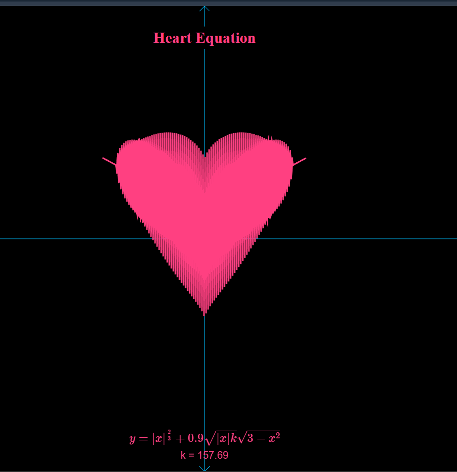
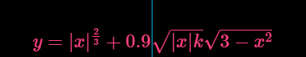
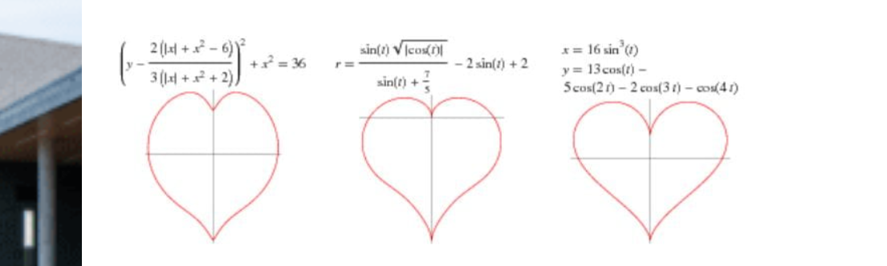

# Animated Heart Curve Visualization 

This project visualizes a **heart-shaped mathematical curve** rendered in real time using the HTML5 Canvas API.  
The curve is generated from a custom analytical equation that combines a classical heart-curve component with a trigonometric modulation, producing a continuously evolving animation.

The goal of this project is **mathematical visualization**, not decorative graphics.

---

## The Equation

The curve is defined by:

\[
y = |x|^(2/3) + 0.9 * sqrt(|x|) * sin(kx) * sqrt(3 - x^2)
\]

where:
- `x ∈ [-2, 2]`
- \(k\) is a time-varying parameter

---

## Mathematical Interpretation

### 1. Base Heart Component

\[
|x|^(2/3)
\]

This term is a **well-known heart-shaped function** used in several classical heart curve formulations.  
It is responsible for:
- The pointed cusp at the bottom
- The symmetric lobes at the top
- Stability near the origin

This term alone produces a static, recognizable heart profile.

---

### 2. Trigonometric Modulation Term

\[
0.9 * sqrt(|x|) * sin(kx)*sqrt(3 - x^2)   \]

This term introduces **controlled oscillatory deformation**:

- `sin(kx)` generates periodic variation
- `k` controls the **frequency** of oscillation (not amplitude)
- `√(3 − x²)` constrains the curve to a real-valued domain
- `√|x|` smoothly suppresses oscillations near the center

Together, these ensure the deformation remains continuous and bounded.

---

## Role of Parameter `k`

- `k` is incremented every animation frame
- Increasing `k` increases oscillation density

This produces a **time-dependent curve**, not a static plot.

---

## Important Clarification (Cardioid vs Heart Curve)

This curve **is not a cardioid**.

A cardioid is a specific polar curve defined by:
\[
r = a(1 ± cosθ)
\]

While cardioids are heart-shaped, **not all heart-shaped curves are cardioids**.  
The equation used in this project belongs to a broader class of **heart-like analytical curves**, intentionally modified for visualization and animation.

Correct terminology matters.

---
## References

1. Wolfram MathWorld — *Heart Curve*  
   https://mathworld.wolfram.com/HeartCurve.html

2. Weisstein, Eric W. *Cardioid.* Wolfram MathWorld  
   https://mathworld.wolfram.com/Cardioid.html

3. A Reffernce Paper :
   https://www.matec-conferences.org/articles/matecconf/pdf/2018/56/matecconf_aasec2018_01001.pdf

---

## License

This project is open for learning, experimentation, and modification.
